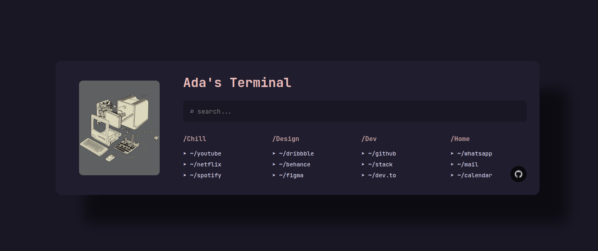

# Ada's Terminal 🖥️


<div align="left">
A minimalist and elegant browser startpage that transforms your new tab into a sleek command center. Quick access to your favorite websites through a terminal-style interface.
</div>

<div align="center">
  
</div>

## 🌟 Features

- **Terminal-Style Navigation**: Access websites through simple commands
- **Quick Search**: Press `/` to view all available commands
- **Smart Autocomplete**: Start typing to filter available options
- **Keyboard Navigation**: Use arrow keys to select from suggestions
- **Custom Categories**: Organized links in convenient sections
- **Minimalist Design**: Clean and distraction-free interface
- **Responsive Layout**: Perfect on any screen size

## 🚀 Usage

1. Press `/` to activate command mode
2. Type a command (e.g., "youtube", "github")
3. Use ↑ and ↓ to navigate suggestions
4. Press Enter to open the selected site
5. Click on any visible link to access directly

### Available Commands

- **Chill**: youtube, netflix, spotify
- **Design**: dribbble, behance, figma
- **Dev**: github, stack, dev
- **Home**: whatsapp, mail

## 📸 Screenshots

<details>
<summary>Click to view more screenshots</summary>

### Command Mode


### Categories View


### Mobile View


</details>

## 🛠️ Installation

1. Clone this repository:
```bash
git clone https://github.com/vito-ysl/adas-terminal.git
```

2. Set as New Tab page using one of these methods:
   - Use "Custom New Tab URL" extension
   - Set up a local server
   - Use GitHub Pages

## 🤝 Contributing

Contributions are welcome! Feel free to:
- Report bugs
- Suggest new features
- Submit pull requests

## 📝 License

This project is licensed under the MIT License - see the [LICENSE](LICENSE) file for details.

## 🙏 Acknowledgments

- Inspired by terminal-style interfaces
- Built with modern web technologies- Built with modern web technologies
- Made with ❤️ by [vito-ysl]

## 🔗 Share & Connect
- [Share on Twitter](https://twitter.com/intent/tweet?text=Check%20out%20Ada's%20Terminal%20-%20A%20minimal%20startpage%20for%20your%20browser!%20https://github.com/vito-ysl/adas-terminal)
- [Share on LinkedIn](https://www.linkedin.com/sharing/share-offsite/?url=https://github.com/vito-ysl/adas-terminal)
